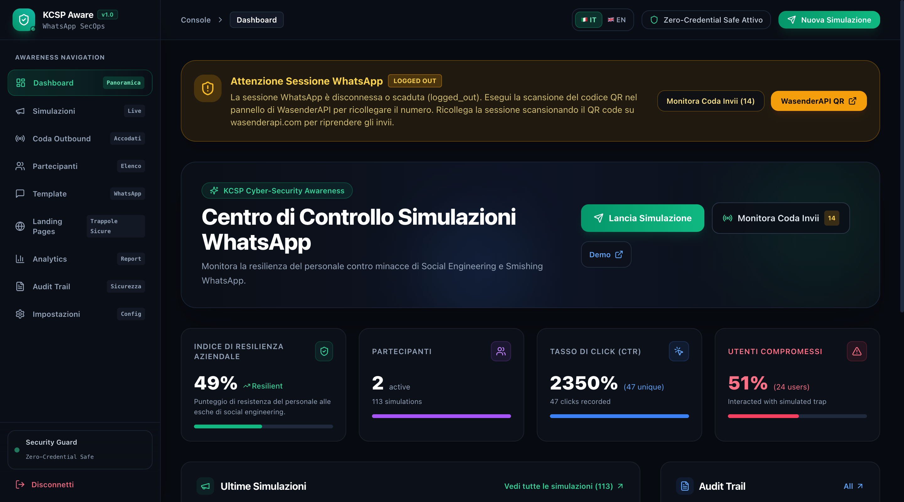
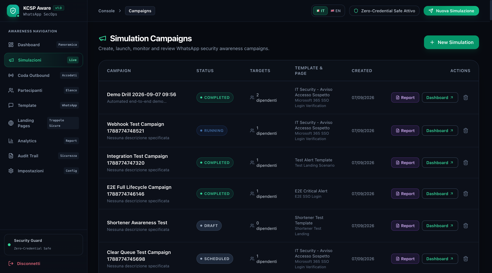
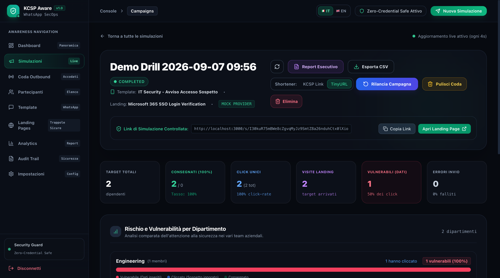
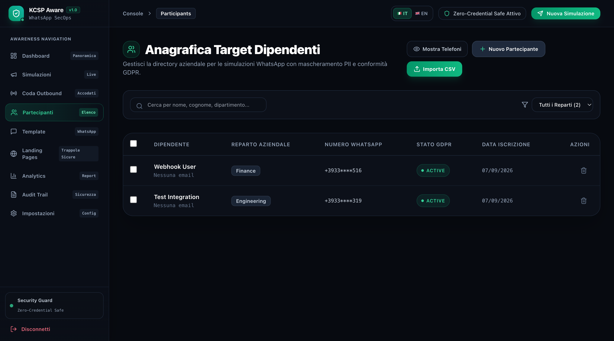
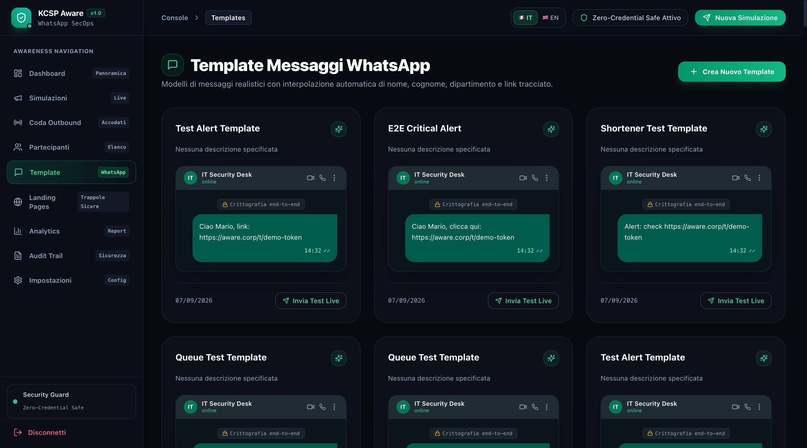
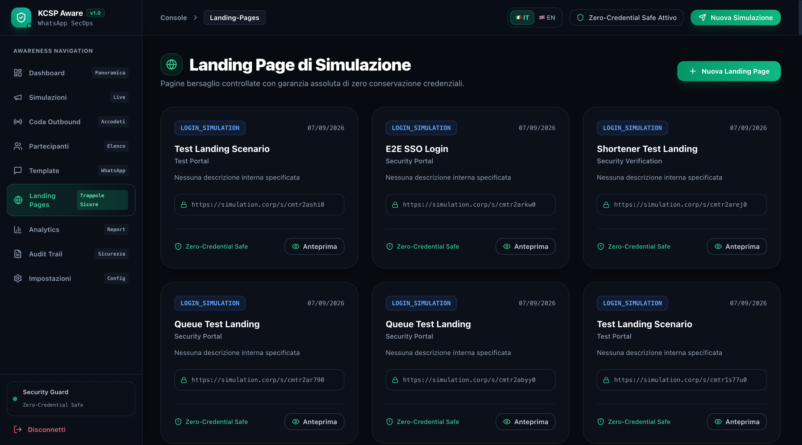
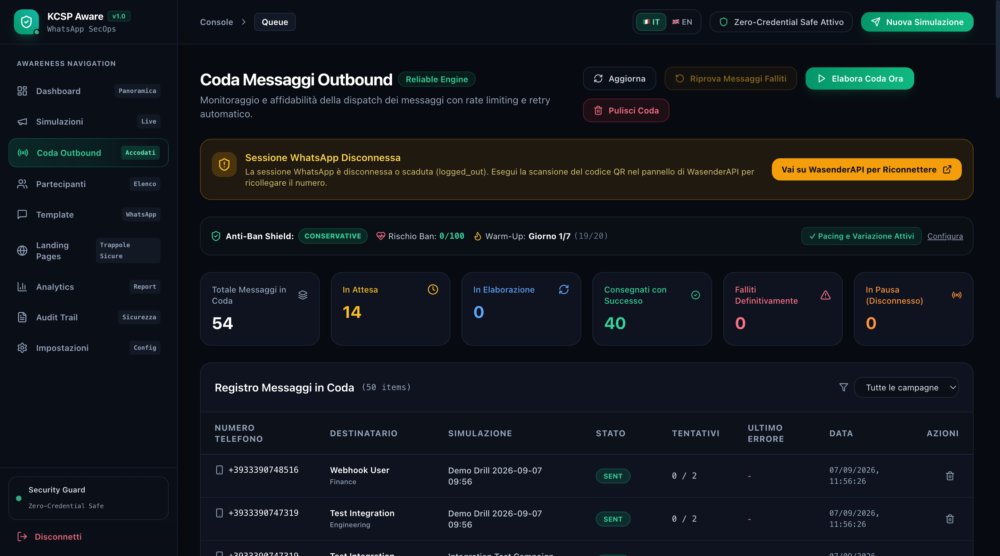
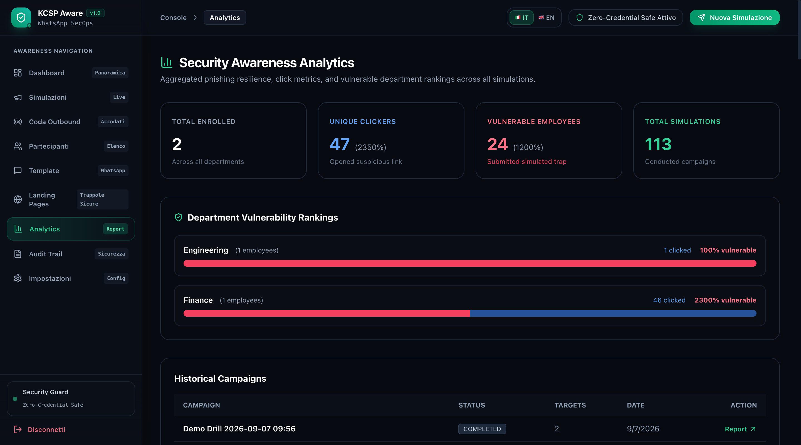
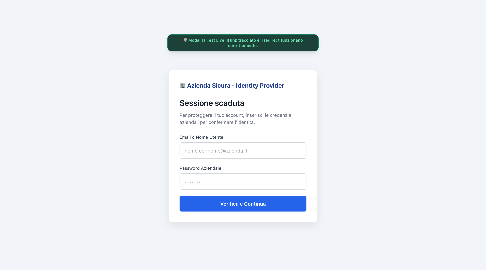
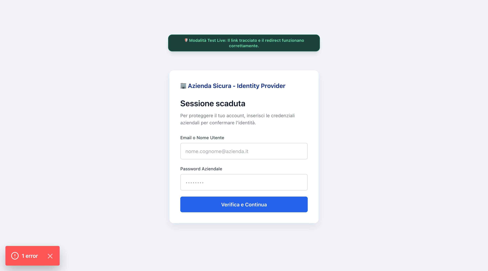

# KCSP — WhatsApp Security Awareness Platform
## Documentation, Interactive Presentation Deck & Video Pitch Suite

---

## 🌟 Overview

The **KCSP (WhatsApp Security Awareness Platform)** is an enterprise-grade modular monolith engineered for conducting authorized security-awareness simulations through WhatsApp. 

While conventional corporate security defenses have hardened corporate email gateways, cybercriminals have shifted to direct mobile messaging (Smishing, QR-phishing, spoofed IT/HR notifications) where open rates exceed **98%** and average response velocities are **under 3 minutes**.

This repository hosts the **public documentation, interactive slide presentation, high-definition video pitch, and production screenshot gallery**.

---

## 🚀 Live Interactive Experiences

| Resource | Description | Live Access |
| :--- | :--- | :--- |
| 🌐 **Master Showcase Portal** | All-in-one portal embedding slides, video player, screenshot gallery, and technical docs | [Launch Portal](index.html) |
| 📊 **Interactive 16:9 Slide Deck** | 12-slide presentation with speaker notes (`N`), fullscreen (`F`), and print-to-PDF | [Launch Slides](slides.html) |
| 🎬 **Video Pitch Player** | Synchronized audio voiceover, 8 storyboard chapters, timeline seeking, and subtitles | [Launch Video Player](video.html) |
| 🖼️ **Live App Walkthrough** | 11 production UI screenshots with architectural feature breakdowns and route details | [Launch Screenshot Tour](walkthrough.html) |
| 📹 **Full HD MP4 Video** | Broadcast-grade 1080p narrated video pitch (3.4 minutes, 4.7 MB) | [Download Video](kcsp_platform_pitch.mp4) |

---

## 📸 Production Screenshots Gallery

All screenshots captured from the live KCSP application in action:

| Screen | Route | Preview |
| :--- | :--- | :--- |
| **Executive Dashboard** | `/dashboard` |  |
| **Campaigns Manager** | `/campaigns` |  |
| **Campaign Telemetry** | `/campaigns/[id]` |  |
| **Participant Roster (GDPR)** | `/participants` |  |
| **WhatsApp Templates** | `/templates` |  |
| **Landing Scenarios** | `/landing-pages` |  |
| **Dispatch Job Queue** | `/queue` |  |
| **Analytics & Risk Heatmap** | `/analytics` |  |
| **Controlled M365 Landing** | `/s/[token]` |  |
| **The Teachable Moment** | `/s/[token]` (Debrief) |  |

---

## 🛡️ Core Platform Differentiators

1. **Zero-Credential Safe Simulation**:
   Form submission hooks intercept credentials client-side in the browser DOM. Passwords, PINs, and MFA tokens are permanently erased and replaced with `USER_ENTERED_VALUE` before network transit. Zero credentials ever reach the server.
2. **Provider-Independent WhatsApp Abstraction**:
   - `MockWhatsAppProvider` for $0 local sandbox testing and CI/CD validation.
   - `WASenderApiProvider` for commercial high-throughput cloud API dispatch.
   - `WPPConnectProvider` for self-hosted sovereign WhatsApp instances.
   - Automatic queue pause if a WhatsApp gateway logs out.
3. **The Teachable Moment (Instant Debrief)**:
   Immediate educational feedback loop highlighting the 3 subtle red flags missed, boosting learning retention by 4x.
4. **GDPR Privacy by Design**:
   - URLs use 32-byte opaque tokens (`/t/[token]`) with zero personal data.
   - Client IPs and User-Agents are salted and hashed via HMAC SHA-256.
   - 1-click participant data anonymization preserves statistical trends.

---

## 📚 Technical Documentation Directory

- 📑 [`docs/SLIDES.md`](docs/SLIDES.md): Complete 12-slide presentation script and speaker notes.
- 📜 [`docs/VIDEO_PITCH_SCRIPT.md`](docs/VIDEO_PITCH_SCRIPT.md): 2-minute executive pitch & 5-minute technical walkthrough scripts.
- 🧭 [`docs/APP_WALKTHROUGH.md`](docs/APP_WALKTHROUGH.md): Annotated 11-screen UI tour and operator workflows.
- 🏗️ [`docs/architecture-and-api.md`](docs/architecture-and-api.md): Monorepo packages, queue dispatch, and webhook ingestion.
- 🇪🇺 [`docs/security-and-gdpr.md`](docs/security-and-gdpr.md): Data minimization, HMAC hashing, and compliance specifications.
- 🐳 [`docs/digitalocean-deployment.md`](docs/digitalocean-deployment.md): Turnkey Docker Compose with automated Caddy HTTPS.
- 🗄️ [`docs/postgres-migration-guide.md`](docs/postgres-migration-guide.md): SQLite WAL mode to Managed PostgreSQL migration path.

---

## 👨‍💻 Author & Maintainer

**Massimo Bozza** // KCSP Security Architecture Team  
Authorized Security Awareness Simulations & Human Cyber Resilience
